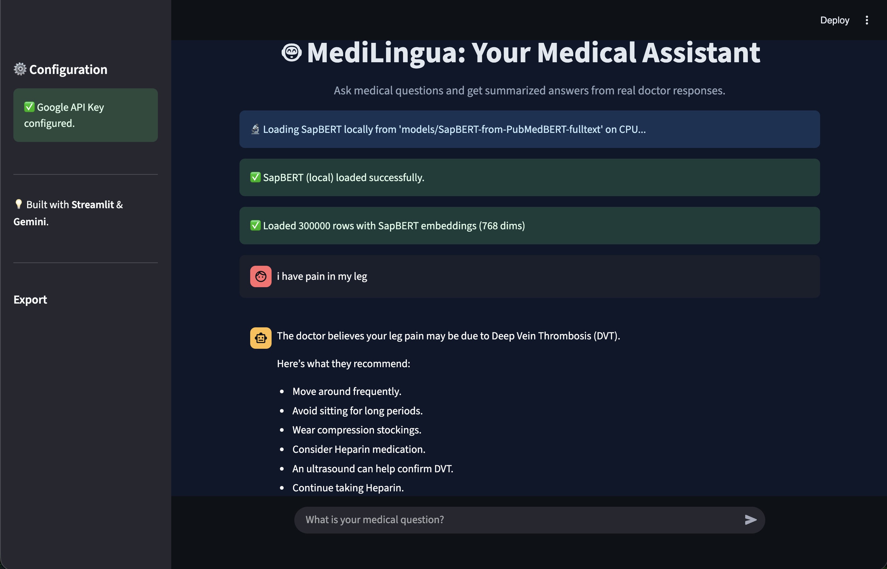

# 🩺 Medi-Lingua — AI Medical Chatbot

Medi-Lingua is an **AI-powered medical chatbot** that delivers patient-friendly summaries of doctor responses.  
It combines **medical domain embeddings (SapBERT)** with **LLM-based summarization (Gemini AI)** to generate accurate, concise, and understandable medical guidance.



---

## 🚀 Overview

Medi-Lingua uses a dataset of **300,000+ medical conversations** with the following columns:

- **Description** → Overview of the medical issue or case  
- **Patient** → Patient’s query or concern  
- **Doctor** → Doctor’s response to the query  

### 🔹 How It Works

1. **Embedding Generation**
   - `(Patient + Description)` text is embedded using the **SapBERT** model.
   - Embeddings are saved in `question_embeddings.pkl`.

2. **User Query Handling**
   - The user submits a query through the **Streamlit** interface.
   - The query is converted to embeddings using the same SapBERT model.
   - Top **10 most similar** cases are found from the dataset using cosine similarity.

3. **Response Summarization**
   - Corresponding doctor responses are fetched and passed to **Gemini AI** with a structured prompt.
   - Gemini generates a **clear, patient-friendly summary** in simple medical terms.

---

## 🧠 Prompt Template Used

You are a professional AI medical assistant.

Summarize the doctor's responses clearly, accurately, and concisely for the patient.
Focus only on medically relevant information that directly answers the user's question.

User's Question:
"{user_question}"

Doctor's Answer(s):
"{combined_answer}"

Instructions:

Provide a medically correct, patient-friendly summary in simple, clear language.

List multiple points as bullets if possible.

If the user's question lacks personal details (e.g., gender, age, weight), generate a generalized, gender-neutral summary.

Avoid gender-specific recommendations unless explicitly mentioned.

Include next steps, treatments, or lifestyle changes if mentioned.

End with a recommendation to consult a relevant doctor (e.g., general practitioner, orthopedist).

If the answers do not address the query, respond:
"There is no information related to your question in the doctor's answer, so I generated the best possible answer based on the information provided."


---

## 🧩 Tech Stack

| Component | Technology |
|------------|-------------|
| **Frontend** | Streamlit |
| **Backend / Logic** | Python |
| **Embeddings Model** | [SapBERT](https://huggingface.co/cambridgeltl/SapBERT-from-PubMedBERT-fulltext) |
| **LLM Summarizer** | Gemini AI |
| **Dataset Storage** | Hugging Face Datasets |
| **Similarity Search** | Cosine similarity / FAISS |
| **Environment** | Conda / venv |

---

## 📦 Setup & Installation

### 1️⃣ Clone the Repository

```bash
git clone https://github.com/git-param/Medi-Lingua.git
cd Medi-Lingua
```

2️⃣ Download Required Assets

Download and place the following folders in the same directory as app.py:

🧠 Model folder: https://huggingface.co/param2004/Medilingua-model

📊 Dataset folder: https://huggingface.co/param2004/Medilingua-dataset


3️⃣ Install Dependencies
```bash
pip install -r requirements.txt
```

4️⃣ Run the Streamlit App
```bash
streamlit run app.py
```


🗂️ Project Structure
```bash
Medi-Lingua/
│
├── app.py                      # Streamlit UI and main logic
├── src/                        # Core backend scripts
│   ├── utils.py
│   ├── search.py
│   ├── llm.py
│   ├── ui.py
│   ├── query_utils.py
│   └── pdf_utils.py
│
├── dataset/                    # Dataset folder (download from Hugging Face)
├── model/                      # Model folder (download from Hugging Face)
├── requirements.txt
├── op.png                      # Sample output image
└── README.md
```

🧪 Workflow Summary

1. Data Processing & Embeddings
   - Embeddings are generated for the Patient + Description column.
   - Saved locally in question_embeddings.pkl.

2. Query Processing
   - User query → Embedded → Top 10 matches retrieved.
   - Response Aggregation
   - Corresponding doctor answers are combined and passed to Gemini AI.

3. Final Output
   - Gemini returns a summarized, medically accurate answer in patient-friendly form.
  
---

👨‍💻 Author

Param Dholakia
B.Tech in Computer Engineering
GitHub: https://github.com/git-param

---

⚠️ Disclaimer

Medi-Lingua is not a substitute for professional medical advice.
Always consult a qualified healthcare provider for diagnosis and treatment.

---

⭐ Show Your Support
If you find this project helpful, please ⭐ the repository — it motivates further development!
```bash
---
✅ **Instructions:**
1. Copy everything above (including the triple backticks and bash label at the top).  
2. Paste it directly into your `README.md` file in your GitHub repo root.  
3. Push the commit — the formatting, tables, and emojis will all render perfectly on GitHub.
```
